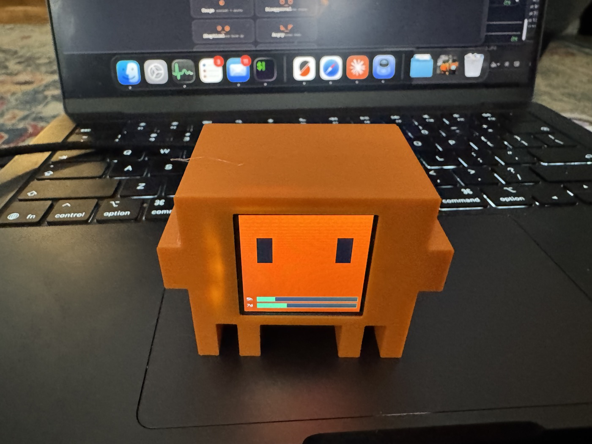
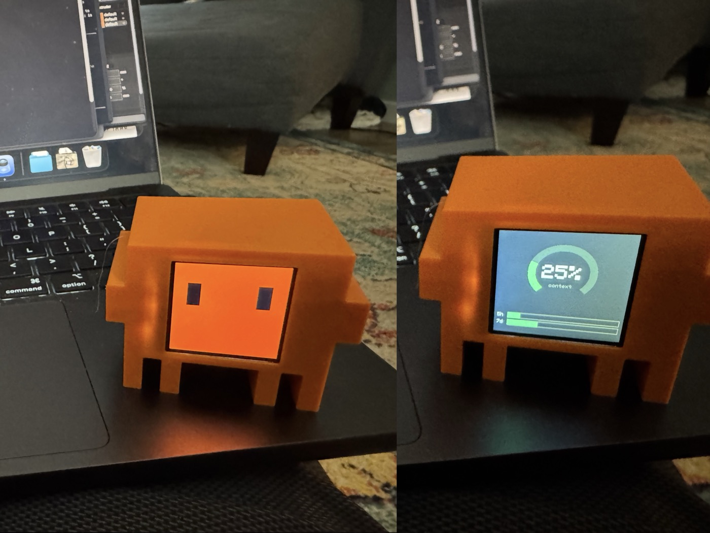

# clawducky

A rubber duck with claws. It sits on your desk, pulls faces at you, and tells
you how much Claude you have left.



An ESP32-C3 driving a 240×240 IPS panel. It shows animated expressions, and it
shows a live readout of your Claude Code usage — how full the context window
is, and how much of your 5-hour and weekly quota you've burned. The context
number is the one that earns its desk space: it answers *"am I about to lose my
working state"* without you having to stop and check.

Derived from [yousifamanuel/clawd-mochi](https://github.com/yousifamanuel/clawd-mochi)
— see [Credits](#credits). **The 3D-printable case lives in that repo**; this
one is firmware only.

---

## What it does

**Expressions.** Eight faces — `disapproval` (ಠ_ಠ), `skeptical`, `angry`,
`sideeye`, `alert`, `happy`, `sleepy`, `dead` — plus the original normal and
squished eyes. Each animates on arrival: brows drop into place, pupils slide
over, then a settle-blink. `alert` pops wide, `dead` shakes it off, `sleepy`
sags and catches itself. Held faces keep blinking on an idle timer so the thing
looks alive rather than paused.



**Usage meter.** A context-occupancy arc over two quota bars. Green below 60%,
amber to 85%, red above — you stop reading it and start just knowing. A feed
older than 15 minutes greys out and says so, so a stale number never passes as
current. Optionally the two bars pin to the bottom of any face view, so you get
usage *and* the duck.

**Cycling.** Every cycle-able view has a checkbox, so you choose what's in the
rotation. With `stats every other` on, the meter takes every second slot — it
keeps half the airtime no matter how many faces you've ticked, which is the
point of having it at all. Picking anything by hand stops the rotation, on the
theory that choosing a thing to look at and then having it yanked away is the
display arguing with you.

**Reacts to your session.** A Claude Code `Stop` hook pushes fresh numbers each
time Claude finishes a turn, and can pull a face while it's at it — a fixed one,
or a different random one every turn.

Everything from the original is still here: the self-hosted web UI, the "Claude
Code" terminal view, and the drawing canvas.

---

## Hardware

| Part | Notes |
|------|-------|
| **Seeed XIAO ESP32-C3** | Or an ESP32-C3 SuperMini — see the wiring note below |
| **1.54" ST7789 IPS, 240×240** | 8-pin with `CS`. The 7-pin no-CS variant works too, see below |
| **U.FL / IPEX antenna** | **Mandatory on the XIAO** — it has no onboard antenna |
| Dupont wires, header pins | 8 connections |
| **3D-printed case** | [From the original project](https://github.com/yousifamanuel/clawd-mochi/tree/main/models) |

### Wiring

> ⚠️ **VCC goes to 3V3, never 5V.** The panel is 3.3V logic.

| Display | GPIO | XIAO pin |
|---------|------|----------|
| VCC | 3V3 | `3V3` |
| GND | GND | `GND` |
| SDA (MOSI) | 10 | `D10` |
| SCL (SCK) | 8 | `D8` |
| RES | 2 | `D0` |
| DC | 5 | `D3` |
| CS | 4 | `D2` |
| BLK | 3 | `D1` |

XIAO header order is `D0`–`D6` down the left, `D7 D8 D9 D10 3V3 GND VUSB` down
the right. Never use GPIO 6 or 7 for SPI.

**Two gotchas that cost real time:**

- **GPIO 1 isn't broken out on the XIAO**, so `DC` moves to GPIO 5 (`D3`). On a
  SuperMini, set `TFT_DC` back to `1` and the rest of the table is unchanged.
- **The XIAO has no onboard antenna** — U.FL connector only. It will appear to
  join WiFi without one, on connector leakage alone, which is exactly why this
  is easy to miss. Range is unusable and transmitting into an unterminated
  connector is bad for the radio. Attach it before powering up.

If your panel is the 7-pin variant with no `CS` line, set `#define TFT_CS -1`.

---

## Build

Arduino IDE 2.x or `arduino-cli`. Install **esp32 by Espressif Systems**, plus
the **Adafruit GFX** and **Adafruit ST7735/ST7789** libraries.

| Setting | Value |
|---------|-------|
| Board | ESP32C3 Dev Module |
| USB CDC On Boot | **Enabled** ← required, or you get no serial |
| CPU Frequency | 160 MHz |
| Upload Speed | 921600 |
| Partition Scheme | **Huge APP (3MB No OTA/1MB SPIFFS)** |

**The partition scheme matters.** The default reserves half the 4 MB flash for
OTA updates this sketch never performs, leaving a 1.31 MB app partition the
firmware nearly fills. `Huge APP` gives it 3 MB — same code, roughly a third of
the usage.

```sh
arduino-cli compile --fqbn \
  "esp32:esp32:esp32c3:CDCOnBoot=cdc,CPUFreq=160,PartitionScheme=huge_app" clawducky
arduino-cli upload -p /dev/cu.usbmodem1101 --fqbn \
  "esp32:esp32:esp32c3:CDCOnBoot=cdc,CPUFreq=160,PartitionScheme=huge_app" clawducky
```

The sketch directory has to be named `clawducky` to match the `.ino`.

### WiFi

```sh
cp wifi_credentials.h.example wifi_credentials.h   # gitignored
```

Fill in your SSID and password. It joins as a station and advertises
`clawducky.local` over mDNS, falling back to its own access point
(`clawducky` / `clawd1234` → `192.168.4.1`) if it can't connect.

> mDNS doesn't cross VLANs. If the duck is on a separate IoT network from your
> workstation, `clawducky.local` won't resolve — use the IP. Pin its DHCP lease
> while you're there, because if the address moves, everything pointing at it
> fails silently.

---

## Usage meter

The device is a **dumb readout**. Something upstream hands it three percentages
and it draws them; it has no idea Anthropic exists and stores no credentials.
That's deliberate — it serves an unauthenticated HTTP UI to the whole LAN, and
anyone holding it can dump its flash over USB. Nothing worth stealing should
live there.

`tools/clawducky-usage.py` is the feeder. It reads context occupancy from the
Claude Code session transcript, pulls the 5-hour and 7-day quota percentages
from Anthropic's OAuth usage endpoint, and pushes all three in one request.

Wire it to a `Stop` hook in `~/.claude/settings.json` — the moment usage
actually changes, so nothing runs while you aren't working:

```json
{
  "hooks": {
    "Stop": [
      { "hooks": [{
          "type": "command",
          "command": "~/path/to/clawducky/tools/clawducky-usage.py >/dev/null 2>&1",
          "async": true
      }] }
    ]
  }
}
```

Set `CLAWD_HOST` if `clawducky.local` doesn't resolve for you. See
[HOOKS.md](HOOKS.md) for the full setup, the status-lamp hooks, and how the
feeder is hardened for hook use (it exits 0 unconditionally — a desk toy must
never break your editor).

**macOS only** as written: the OAuth token comes from the Keychain entry Claude
Code already maintains, so token refresh is handled for you. Ports to other
platforms need a different credential read; everything else is portable.

---

## HTTP API

Everything is a `GET`, so you can drive the whole thing with `curl`.

| Endpoint | What it does |
|----------|--------------|
| `/face` | List available expressions as JSON |
| `/face?f=<id>` | Show one, with its entry animation |
| `/meter?ctx=&session=&week=` | Push percentages; any subset, omitted values persist |
| `/meter?...&stop=1` | ...and signal a finished turn |
| `/meter/view` | Switch to the full usage readout |
| `/meter/overlay?on=0\|1` | Pin the quota bars to the bottom of face views |
| `/meter/cycle?on=0\|1&sec=N` | Rotate through the ticked views every N seconds |
| `/meter/cycle?item=<key>&on=0\|1` | Tick/untick a view: `eyes`, `squish`, `meter`, or a face id |
| `/meter/cycle?random=0\|1&mix=0\|1` | Random order; interleave the meter between faces |
| `/stopface?mode=none\|fixed\|random&f=<id>` | What a finished turn looks like; `random` draws from the ticks |
| `/cmd?k=w\|s\|d\|a` | Original views: normal, squish, Claude Code, logo |
| `/claude?e=working\|waiting\|done\|error\|idle` | Status-lamp states |
| `/speed?v=1\|2\|3` | Animation speed |
| `/backlight?on=0\|1` | Display on/off |
| `/state` | Full device state as JSON |

`/state` returns everything the device knows about itself, which is how the web
UI restores its own selection after a reload rather than guessing:

| Field | Meaning |
|-------|---------|
| `view` | Current view (0 eyes, 1 squish, 2 code, 3 canvas, 4 expression, 5 meter) |
| `expression` | Which face is on screen |
| `overlay` | Quota bars pinned to the bottom of face views |
| `cycle` / `cyclesec` / `cyclerandom` | Auto-cycle state, interval, randomize |
| `stopmode` | On-stop policy: `none`, `fixed` or `random` |
| `stopface` | Which face `fixed` uses — remembered while you toggle modes |
| `busy` | Device is mid-animation and won't answer promptly |
| `speed`, `bl`, `sta`, `ip` | Animation speed, backlight, WiFi mode, address |

Settings persist to NVS and survive a power cycle — except the backlight, which
deliberately doesn't, because booting to a black screen reads as dead hardware.

---

## Adding an expression

Faces are data, not code. Every one is an eye shape plus an optional brow, so a
new face is a row in `EXPRESSIONS[]`:

```c
//  id            shape     brow   tiltL tiltR  bHalf bGap  pupil pOX  anim
{ "smug",         ES_RING,  true,     -6,   -6,    38,   7,  true,   0, AN_NONE },
```

`tiltL`/`tiltR` move the *inner* end of each brow, so one value mirrors
correctly across the face — positive drops it toward the nose (angry), negative
raises it. Animations layer runtime deltas over that resting pose
(`drawExpressionFrame`), which is why a new motion is a sequence of numbers
rather than another draw function.

The web UI builds its buttons from `/face`, so the firmware stays the single
source of truth for which expressions exist.

---

## Credits

Built on **[clawd-mochi](https://github.com/yousifamanuel/clawd-mochi)** by
[yousifamanuel](https://github.com/yousifamanuel) — the original concept, the
web UI, the eye animations, the terminal view, the drawing canvas, and the
3D-printable case. **The models are still only in that repo**; go there for
anything you intend to print, and give it a star while you're at it.

This is a separate project rather than a pull request because the direction
diverged: the usage meter and the Claude Code telemetry integration are a
different thing from a desk toy, and upstream isn't currently taking patches.

MIT, same as the original.
